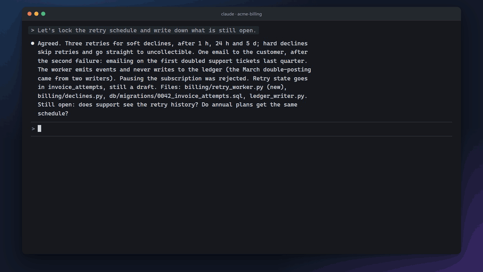

<p align="center">
  
</p>

<h1 align="center">markup</h1>

<p align="center"><b>Your agent's plan as a page you can comment on.</b></p>

<p align="center">
  
  <br><sub>The real skill on a sample project. The terminal is a re-enactment with the real publish output; the browser part is recorded live.</sub>
</p>

A long session with a coding agent produces decisions, flows, numbers and open questions. By the end they sit in the chat as paragraphs, three screens up. `/markup` turns the conversation into a local web page made of tables, diagrams and charts. You comment on it in the browser like you would on a shared document, and the agent answers right there, edits the plan and publishes a new version.

## Install

```
npx skills add motcke/markup-skill
```

Then type `/markup` in a Claude Code session that has something worth showing. You need Node 18 or newer and nothing else: the server is one ESM file on `node:http` with no npm dependencies, and the page loads no CDN, so it works offline.

## What you get

| Feature | What it does |
| --- | --- |
| A page instead of a wall of text | Decisions become a sortable table with status colors, flows become mermaid diagrams, numbers become Chart.js charts, and the headline figures sit at the top. The agent checks what it writes about the code against the repository. |
| Comments on anything | Select words and press "Comment", right-click any element, or press `C`. The card sits next to the text it belongs to. Paste a screenshot or attach a file. |
| Answers on the page | Press "Wake the agent" when you finish a round. The agent reads every thread, replies in its card, edits the plan and republishes. The open tab reloads by itself, and changed sections carry an "updated" tag until you mark them seen. |
| Questions you answer with a click | When the agent needs a decision, it asks on the page with options to pick. Your picks are saved with the plan and reach the agent on the next round. |
| Every version kept | Each republish is a version with a note on what changed. A context meter shows how much of the session's context each version took. |
| Your language | The page follows the language of the conversation. Hebrew, Arabic and Persian switch the layout to right-to-left without any setting. |
| Dark mode and print | Dark mode follows the system or a toggle. Printing gives A4 pages with the plan title, page numbers and tables that do not split. Narrow windows move the comments into a bottom sheet. |

## A round, step by step

1. `/markup` writes the page, serves it on a stable port for the project and opens your browser.
2. You read, comment and answer the agent's questions.
3. "Wake the agent" wakes the session that published the page. When no agent is listening, the button copies `/markup comments <page>` to your clipboard for you to paste into the session.
4. The agent answers each thread in place, updates the plan and publishes a new version. Repeat until nothing is open.

| Command | Does |
| --- | --- |
| `/markup` | Create the page for this conversation, or update it if this session already published one |
| `/markup <slug>` | The same, with an explicit page name |
| `/markup comments` | Read the open threads and answer them now |
| `/markup open` | Start the server and open the browser, nothing else |
| `/markup issue <text>` | Report a bug or an idea about markup itself. The agent drafts a GitHub issue, shows it to you, and files it with your `gh` once you approve |

The same report form sits behind "?" in the page's top bar ("Report a bug or idea to markup"). If you would rather not involve the agent, it opens GitHub's new-issue page with your text filled in.

## Where your data lives

Everything is written to `.markup/` at the project root: content, comment threads, version history, attachments. The skill adds `.markup/` to the project's `.gitignore` on first publish, so pages stay next to the code but out of history. Kill the server whenever you like; it holds no state.

Multiple sessions can work on one project. Each page belongs to the session that published it, and "Wake the agent" wakes only the agent that is listening to that page.

## Updating

Each project's server checks GitHub once a day for a newer release. When there is one, the page's top bar shows an update chip with the release notes and an upgrade button:

- If you never changed the skill's files, the button upgrades in place: it downloads the new files, verifies each against the release manifest, backs up what it replaces, and restarts the server.
- If you did change them, the button hands the upgrade to your agent. It looks at what you changed, merges it with the new release, and shows you a report to approve before it writes anything.
- `node server.mjs upgrade <project> rollback` restores the previous version from the backup.

Turn the check off with `{"updateCheck": false}` in `~/.markup/config.json`, and the usage statistics the server sends with `{"telemetry": false}`.

## Customizing

Your preferences, lessons and extensions live in `~/.markup/`, and upgrades never touch that folder. Styles, page components, extra libraries, check rules and CLI commands all plug in there without editing the skill, so an upgrade has nothing to merge. See [docs/extensions.md](docs/extensions.md).

## Compatibility

Built and verified on Claude Code. The server itself is agent-agnostic: every call carries an explicit `--session` id, and when the environment provides none the server issues one. Other agents are a stated goal, not a tested one yet.

| Surface | Status |
| --- | --- |
| Claude Code CLI, Windows terminal | verified |
| Claude Code CLI inside VS Code | verified |
| Claude Code VS Code extension (native panel) | untested |
| Claude Desktop | untested |
| Claude Code on the web / Cowork | not supported: the agent runs in a sandbox, so your browser cannot reach its `localhost` |
| macOS / Linux | untested; the code uses `path` and per-platform browser open, but no full run has happened there yet |

Two features degrade without Claude Code; everything else works without it. The context meter reads `~/.claude/projects` transcripts and hides itself when there are none. The wake-on-done loop uses Claude Code's Monitor tool; other agents run `wait` in the foreground. A press with nobody listening copies the follow-up command to your clipboard, and the press is kept for 24 hours, so the next `wait` picks it up.

The optional in-browser page check (`check --browser`) uses the global `WebSocket` client and needs Node 22; on older Node it skips and says so.

## Repository layout

- `SKILL.md`: the instructions the agent loads
- `server.mjs`: server and CLI, zero dependencies
- `lib/`: versioning, update check, upgrade, extension loading, issue reports
- `manifest.json`, `CHANGELOG.md`: the release's version, file hashes and notes ([docs/RELEASING.md](docs/RELEASING.md) describes how a release is cut)
- `defaults/`: the starting copies of `~/.markup/preferences.md` and `learnings.md`
- `template.html`, `home.html`, `assets/`, `vendor/`: the page runtime, self-contained, no CDN
- `references/`: content and component guides the agent reads before writing a page
- `docs/`: [extensions](docs/extensions.md), [page conventions](docs/page-conventions.md) for contributors, and the [release process](docs/RELEASING.md)

## License

Apache 2.0. See [LICENSE](LICENSE).
